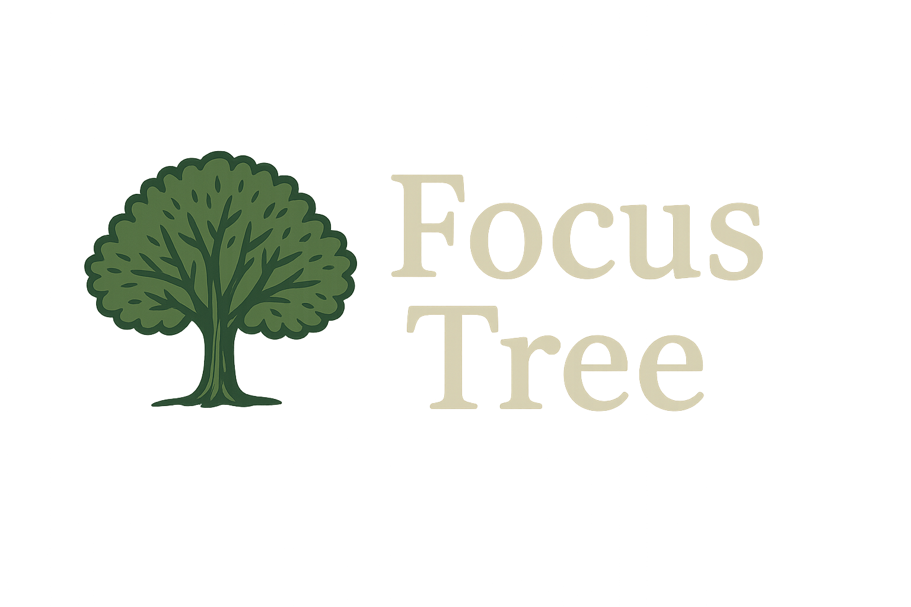

# 🌱 FocusTree App

A green, aesthetic Flutter productivity app that helps you stay focused and grow a virtual tree as you work.  
It’s a blend of task management and Pomodoro-style timers — with gamification built in.

 <!-- replace with actual path or link -->

---

##  Features

-  **Task Manager**
  - Add daily tasks
  - Set priority (Low, Medium, High) via dropdown
  - Priority color gradient (green → orange → red)
  - Tasks saved locally and persist on restart

-  **Custom Timer**
  - Choose your focus duration
  - Timer visual with countdown
  - Seeds grow into a full tree (seed1 → seed5.png) based on your focus time

-  **Design**
  - Aesthetic green color theme
  - Animated seed growth using Flutter animation
  - Custom font (`PlayfairDisplay`)

---

##  Folder Structure
lib/
main.dart # Single main file that contains all widgets
assets/
images/ # seed1.png → seed5.png, logo.png
fonts/ # PlayfairDisplay-Black.ttf

yaml
Copy
Edit

---

## 🔧 Getting Started

### 1. Clone the repo

bash
git clone https://github.com/mahaibrahim26/FocusTreeApp.git
cd FocusTreeApp
2. Install dependencies
bash
Copy
Edit
flutter pub get
3. Run the app
bash
Copy
Edit
flutter run
📱 For iOS: Open ios/Runner.xcworkspace in Xcode, select your team, connect your iPhone, and run it.

🔤 Font & Assets Setup
In pubspec.yaml:

yaml
Copy
Edit
flutter:
  assets:
    - assets/images/
  fonts:
    - family: Playfair
      fonts:
        - asset: lib/fonts/PlayfairDisplay-Black.ttf
📸 Screenshots
<!-- Add your own screenshots here -->
Home	Timer	Tree Growth

🚀 Future Ideas
Focus streak tracking

Notifications when timer ends

Sync with Google Calendar

💚 Made with Flutter
By @mahaibrahim26

yaml
Copy
Edit

---

Let me know if you want a **shorter version**, a **student pitch-friendly version**, or a version wit

